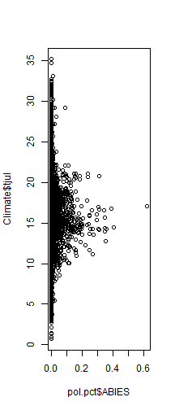

Introduction to R - Maine Pollen Camp
========================================================

by Simon Goring

The popularity of R is rapidly increasing in scientific research.  R has several advantages over other programming languages: it is free, it is fairly powerful, there is an excellent user community, and it was designed with the statistical analysis of data in mind.

Certainly other programming languages exist, Matlab and Python are two standard examples, one paid, the other open source.  Regardless, I can only teach you about one language, and I know R, so that's what you're going to learn.  The other advantage of R is that there has been considerable development of tools for paleoecologists and other pollen workers, which makes it an attractive tool for this workshop.  There's also lots of resources for help available, and I've written about some of them (here)[http://downwithtime.wordpress.com/2014/05/22/r-tips-i-wish-i-had-learned-earlier-getting-help-in-r/].

You are certainly welcome to try to do this workshop using a different programming language, but there will be less support.  Also, these teaching materials are available in R Markdown, HTML and GitHub flavored Markdown, which means that all code is available in R.  Effectively, this tutorial and workshop comes with a solutions manual for R.  If you want to make one for Python, go ahead.  It would be awesome!

Setting Up for the Workshop
=========================================
You should make a folder for this workshop to keep your files together.  I suggest creating a directory structure that looks like this:

`Simons_Amazing_Workshop`<br>
  +-- `R`<br>
  +-- `data`<br>
  |     +-- `input`<br>
  |     +-- `output`<br>
    

Maybe you can change the name of the top level directory, but I suggest keeping the names of the rest of the files.  There is some good advice on the [Nice R](http://nicercode.github.io/blog/2013-04-05-projects/) blog.  I like to keep the input and output folders together within the `data` directory.  This is because I tend to like fewer folders, and because I find that I use a lot of intermediate files in my analysis, I like to have things in the data folder so that everything I use for analysis comes from the same parent folder.

I tend to use R Markdown for most of my analysis.  I keep a 'control' file in the main directory, that then calls routines out of the `R` directory.  I like this structure because I like mapping out my projects beforehand, and I like keeping the seperate pieces of analysis, well, seperate.

So, now that you've got your folders set up, we need to put things into them:


Opening Files, Your First Look at Pollen:
=========================================
We want people to be on the same page, or at least, have some basic background before we start the course.  To do that it helps if you've looked at some pollen data, and this data will be used throughout the course for our analysis to provide a framework for learning about pollen analysis with R.

So, let's look at some pollen data.  The North American Modern Pollen Database is located online at Konrad Gajewski's Laboratory for Paleoclimatology and Climatology [website](http://www.lpc.uottawa.ca/data/modern/).  The NAMPD was published as part of Whitmore et al. ([2005](http://dx.doi.org/10.1016/j.quascirev.2005.03.005)), a large, continental scale dataset.  Download the file into your `data/input` folder and extract it.  You'll see it is an Excel file inside a folder called `modern`.  R doesn't have native support for opening Excel files (although there is a package for it), but we'll get to that later.  First, lets look at the file.

There are multiple sheets in the spreadsheet:

Sheet | Description
----- | -----------
UPDATE HISTORY |  Details of changes to the database.
METADATA | Information about the publications, and each of the tables in the database.
POLLEN DATA | The actual count or percentage data associated with the database.
CLIMATE+BIOCLIMATE | Climate data from Pat Bartlein, more information in Whitmore et al. (2005)
AVHRR | AVHRR data interpreted using Feverova (1994).
POSITIONAL ERRORS | Positional errors.
REMOVED POLLEN SITES | Sites removed or moved.
EAST_WEST | Pollen types broken into classes based on geography.

For the purposes of this analysis we are interested in both pollen and climate data.  There are several ways of doing this:

1.  Save worksheets as csv files to read into R.
2.  Read data in from the `analogue` package.

At this point I assume you've already installed R and RStudio.  If not, install R using this [link](http://cran.rstudio.com/) and RStudio from [this](http://www.rstudio.com/ide/download/desktop) link.  We're going to work through each of these scenarios:

1.  Save Worksheet as CSV, Open in R.
-------------------------------------------
Open up the excel file.  For each of the Pollen and Climate sheets within the spreadhseet click `Save As`, save as 'Text CSV', or 'CSV - comma delimited'.  Tab delimited would be fine too.  I use comma separated because the delimitation is clearer than a tab (i.e., it is visible in a document), and it's human readable, meaning anyone can open up the file using a text reader and figure out what the data looks like.

Once the files are saved you should have a `data/input` folder that looks like this (you don't have to use my naming conventions):

`Simons_Amazing_Workshop`<br>
  +-- `R`<br>
  +-- `data`<br>
  |    +-- `input`<br>
  |    |    +-- `mpd_pollen.csv`<br>
  |    |    +-- `mpd_clim.csv`<br>
    
To read it into R you need to use the command `read.csv`, make sure you're in the proper working directory using `setwd`.  RStudio lets you do this very easily, under the 'Session' drop-down menu (Session > Set Working Directory), but you might want write this directly into the code.

To open the file we need to both open the file in R using `read.csv` (us `?read.csv` to find help) and assign it to a variable.  Let's call the new variables `pollen` and `climate`.  


```r
pollen <- read.csv("data/input/mpd_pollen.csv", stringsAsFactors = FALSE)
climate <- read.csv("data/input/mpd_climate.csv", stringsAsFactors = FALSE)
```


We set the variable `stringsAsFactors` because R has default behaviour that sets strings to a variable type called a `factor` by default.  Because this table has columns that contain both text and numbers R has default behaviour to read in the table as a data object called a `data.frame`.  You can read more about data types, including vectors, matrices and lists [here](http://www.statmethods.net/input/datatypes.html).  For the mostpart we will be using  `data.frame` and `list` objects.

2.  Read data in from the `analogue` package.
---------------------------------------------------
Now we've got the data into R from file.  We can also find pollen data in the `analogue` package for R.  This is a seperate package in addition to the base R program.  To install it you need internet access, and then the function `install.packages`.  Pacakges are sets of data, functions and objects that generally have a common theme.  `analogue` is one of the primary paleoecological packages, written by Gavin Simpson.  You need to install it using the R function `install.packages`.  It may ask you to select a repository from which to install, choose the one closest to you.

```
install.packages('analogue')
```

You also need to load the package into memory using the `library` command: `library(analogue)`.  This way all the functions and datasets within the package are available in R.  To load data from packages you can use the command `data`.  If you look at the help for `analogue` using the `?` you'll see a dataset called `Pollen` and a dataset called `Climate`.  We can put this datset into memory using: `data(Pollen)` and `data(Climate)`.  Now, in that case the dataset is loaded with a capital 'P' and 'C', where we used lower case letters when we loaded the data into memory from file.  Lets look at the two different datasets.


Looking at Data
------------------------------------------

The pollen and climate tables are now in memory, and we can find a little bit about them using some basic commands.  R provides a number of ways to look at datasets.  First, look at the dimensions of the datasets using the `dim` function.  Apply the function to the dataset using `dim(pollen)`.  What are the dimensions of each of the datasets?

Notice that the `pollen` dataset is bigger than the `climate` dataset, and the `Climate` and `Pollen` dataset.  Why does it have extra rows?  Who knows.

How do you find column names?  Try seaching for the term `column` using either `??'column name'` or `help.search('column name')`.  Can you find the right function?

Lets use the `Pollen` and `Climate` datasets from here on in.  Find the column names of the `Pollen` dataset and the column names of the `Climate` dataset.

Once you know the column names you can start looking at values within each column.  Pollen data is generally recorded as counts in the NAMPD, or whole number percentages, but we usually evaluate it as percentages.  To convert the values to proportions we can divide each entry in a row by the sum of the row.  See if you can use `help.search` to figure out how to get the sum of a row.  Send the results of the function to a varaible called `pol.sums`.  Once you have the row sums you can divide the pollen data.frame by those sums to get pollen proportions.


```r
pol.pct <- Pollen/pol.sums
```


This effectively divides each value in each row of the Pollen matrix by the corresponding row sum.  We now have pollen proportions for each of the. . . how many pollen types are there? (hint: use `ncol`).

There are a few basic plotting functions, including `plot` and `hist`.  See if you can use these functions to first plot out individual columns in the `pol.pct` and `Climate` variables, and then see if you can plot the data to get a sense of its structure.  You can also use the function `summary` to look at the data structure.

Try plotting variables against one another.  You can use tab completion here as well.  Typing tab after the $ will give you a list of possible column names to use.  The $ indicates that you are calling a specific column.


```r
plot(pol.pct$ABIES, Climate$tjul)
```

 


Do some plotting among other variables.  Typically we look at July temperature (`Climate$tjul`) and Annual Precipitation (`Climate$annp`), but you're not limited to these variables.

If you've gotten this far then great!  If you're having trouble please let me know, and I'll see you next week.

Thanks.
